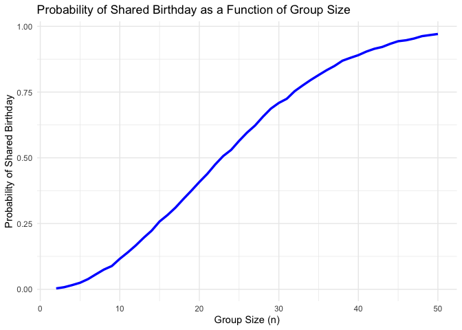

p8105_hw5_zl3543
================

### Problem 1

``` r
# Define the function to simulate birthdays and check for duplicates
simulate_shared_birthday <- function(n) {
  birthdays <- sample(1:365, n, replace = TRUE) 
  return(any(duplicated(birthdays)))           
}

# Run simulations for group sizes from 2 to 50
set.seed(123) 
group_sizes <- 2:50
num_simulations <- 10000
results <- sapply(group_sizes, function(n) {
  mean(replicate(num_simulations, simulate_shared_birthday(n)))
})

# Plot the results
plot_data <- data.frame(GroupSize = group_sizes, Probability = results)
ggplot(plot_data, aes(x = GroupSize, y = Probability)) +
  geom_line(color = "blue", linewidth = 1.2) +  # Use `linewidth` instead of `size`
  labs(title = "Probability of Shared Birthday as a Function of Group Size",
       x = "Group Size (n)", y = "Probability of Shared Birthday") +
  theme_minimal()
```

<!-- -->
