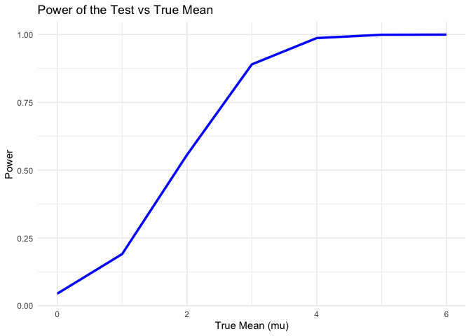
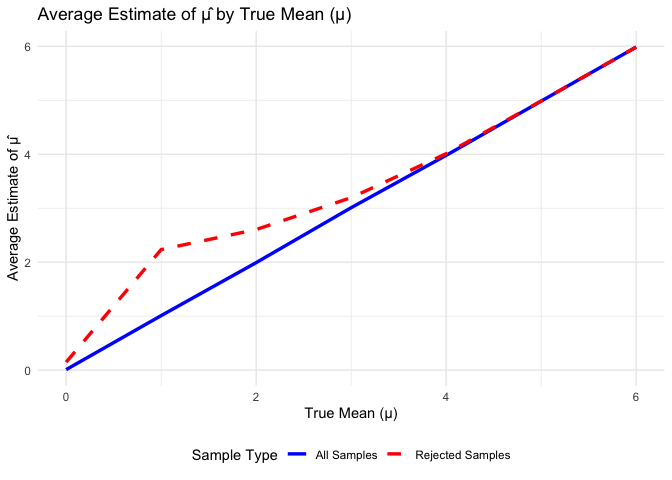
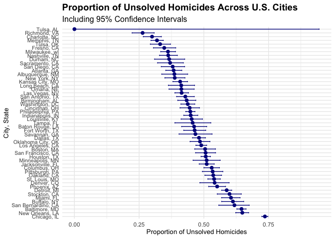

p8105_hw5_zl3543
================
Zihan Lin

### Problem 1

``` r
# Define the function to simulate birthdays and check for duplicates
simulate_shared_birthday <- function(n) {
  birthdays <- sample(1:365, n, replace = TRUE) 
  return(any(duplicated(birthdays)))           
}

# Run simulations for group sizes from 2 to 50
set.seed(123) 
group_sizes <- 2:50
num_simulations <- 10000
results <- sapply(group_sizes, function(n) {
  mean(replicate(num_simulations, simulate_shared_birthday(n)))
})

# Plot the results
plot_data <- data.frame(GroupSize = group_sizes, Probability = results)
ggplot(plot_data, aes(x = GroupSize, y = Probability)) +
  geom_line(color = "blue", linewidth = 1.2) +  # Use `linewidth` instead of `size`
  labs(title = "Probability of Shared Birthday as a Function of Group Size",
       x = "Group Size (n)", y = "Probability of Shared Birthday") +
  theme_minimal()
```

<!-- -->

### Problem 2

``` r
# Set parameters
n <- 30      # Sample size
sigma <- 5   # Standard deviation
mu_values <- 0:6  # True means to test
alpha <- 0.05     # Significance level
num_simulations <- 5000

# Initialize a data frame to store results
results <- data.frame(mu = numeric(), estimate = numeric(), p_value = numeric())

# Set a seed for reproducibility
set.seed(123)

# Run simulations for each true mean (mu)
for (mu in mu_values) {
  for (i in 1:num_simulations) {
    # Generate data from normal distribution with specified mean (mu) and standard deviation (sigma)
    x <- rnorm(n, mean = mu, sd = sigma)
    
    # Conduct a one-sample t-test with null hypothesis mu = 0
    t_test <- t.test(x, mu = 0)
    
    # Store the true mean (mu), estimated mean (mean of x), and p-value from the test
    test_result <- tidy(t_test)
    results <- rbind(results, data.frame(mu = mu, estimate = test_result$estimate, p_value = test_result$p.value))
  }
}

# Calculate power (proportion of rejections) and mean estimates for each mu
power_results <- results %>%
  group_by(mu) %>%
  summarize(
    power = mean(p_value < alpha),  # Proportion of times null is rejected (power)
    mean_estimate = mean(estimate), # Average estimate of mu_hat
    mean_estimate_rejected = mean(estimate[p_value < alpha], na.rm = TRUE) # Average estimate when null is rejected
  )

# Plot power as a function of the true mean (mu)
ggplot(power_results, aes(x = mu, y = power)) +
  geom_line(color = "blue", linewidth = 1.2) +
  labs(title = "Power of the Test vs True Mean",
       x = "True Mean (mu)",
       y = "Power") +
  theme_minimal()
```

<!-- -->

As we can see, the plot shows a clear association between effect size
(the true mean 𝜇 and power: 1) Increasing Power with Effect Size - As
the true mean 𝜇 increases, the power of the test increases. This is
because larger effect sizes make it easier to detect a difference from
the null hypothesis (which assumes 𝜇=0). When the true mean is close to
zero, the power is low, meaning it’s harder to detect a difference. As
𝜇moves further from zero, it becomes easier to reject the null
hypothesis correctly. 2) Nonlinear Growth - the relationship between
effect size and power is nonlinear. At small effect sizes, increases in
𝜇 lead to larger improvements in power. However, as 𝜇continues to
increase, gains in power taper off, approaching a maximum of 1. This is
typical because, with very large effect sizes, the probability of
correctly rejecting the null hypothesis is almost certain. 3)
Significance Threshold Effect - Since the significance level 𝛼=0.05
determines the cutoff for rejection, small true means might often lead
to p-values that don’t meet this threshold, resulting in low power. As
the true mean increases, however, the effect becomes large enough to
consistently yield p-values below 𝛼, enhancing power.

``` r
# Assuming `results` is the data frame with simulation results
average_estimates <- results %>%
  group_by(mu) %>%
  summarize(
    mean_estimate = mean(estimate, na.rm = TRUE), # Average estimate across all samples
    mean_estimate_rejected = mean(estimate[p_value < 0.05], na.rm = TRUE) # Average estimate for rejected nulls
  )

# Plot average estimate of mu_hat as a function of the true mean (mu)
ggplot(average_estimates, aes(x = mu)) +
  geom_line(aes(y = mean_estimate, color = "All Samples"), size = 1.2) +
  geom_line(aes(y = mean_estimate_rejected, color = "Rejected Samples"), size = 1.2, linetype = "dashed") +
  labs(title = "Average Estimate of μ̂ by True Mean (μ)",
       x = "True Mean (μ)",
       y = "Average Estimate of μ̂") +
  scale_color_manual(name = "Sample Type",
                     values = c("All Samples" = "blue", "Rejected Samples" = "red")) +
  theme_minimal() +
  theme(legend.position = "bottom")
```

    ## Warning: Using `size` aesthetic for lines was deprecated in ggplot2 3.4.0.
    ## ℹ Please use `linewidth` instead.
    ## This warning is displayed once every 8 hours.
    ## Call `lifecycle::last_lifecycle_warnings()` to see where this warning was
    ## generated.

<!-- -->

The sample average of 𝜇^ across tests for which the null is rejected is
not exactly equal to the true value of 𝜇. This is due to selection bias:
we are only considering samples that show a statistically significant
result when the null hypothesis is rejected. When we restrict to samples
where the null hypothesis was rejected, we are more likely to include
samples where the observed effect size is larger than average. In
summary, the mean of 𝜇^ across rejected tests tends to overestimate the
true mean, particularly for smaller effect sizes, due to the bias
introduced by only including significant tests. Because we’re only
examining a subset of data that meets a specific significance criterion,
our subset is biased, which leads to an overestimation of the true
effect size in samples where the null hypothesis was rejected,
especially when the actual effect size is small.

### Problem 3

``` r
# Load the dataset
homicides <- read.csv("https://raw.githubusercontent.com/washingtonpost/data-homicides/master/homicide-data.csv")

# Create the `city_state` variable and summarize data
city_summary <- homicides %>%
  mutate(
    city_state = paste(city, state, sep = ", "),  # Combine city and state
    unsolved = disposition %in% c("Closed without arrest", "Open/No arrest")  
  ) %>%
  group_by(city_state) %>%
  summarize(
    total_homicides = n(),                    
    unsolved_homicides = sum(unsolved),        
    .groups = "drop"
  )

# Display the city summary table in a clean format
city_summary %>%
  rename(
    `City, State` = city_state,
    `Total Homicides` = total_homicides,
    `Unsolved Homicides` = unsolved_homicides
  ) %>%
  arrange(desc(`Unsolved Homicides`)) %>%
  knitr::kable(
    caption = "Summary of Total and Unsolved Homicides by City",
    format = "markdown"
  )
```

| City, State        | Total Homicides | Unsolved Homicides |
|:-------------------|----------------:|-------------------:|
| Chicago, IL        |            5535 |               4073 |
| Baltimore, MD      |            2827 |               1825 |
| Houston, TX        |            2942 |               1493 |
| Detroit, MI        |            2519 |               1482 |
| Philadelphia, PA   |            3037 |               1360 |
| Los Angeles, CA    |            2257 |               1106 |
| New Orleans, LA    |            1434 |                930 |
| St. Louis, MO      |            1677 |                905 |
| Dallas, TX         |            1567 |                754 |
| Jacksonville, FL   |            1168 |                597 |
| Indianapolis, IN   |            1322 |                594 |
| Washington, DC     |            1345 |                589 |
| Columbus, OH       |            1084 |                575 |
| Las Vegas, NV      |            1381 |                572 |
| Oakland, CA        |             947 |                508 |
| Phoenix, AZ        |             914 |                504 |
| Kansas City, MO    |            1190 |                486 |
| Memphis, TN        |            1514 |                483 |
| Miami, FL          |             744 |                450 |
| Milwaukee, wI      |            1115 |                403 |
| Atlanta, GA        |             973 |                373 |
| San Antonio, TX    |             833 |                357 |
| Birmingham, AL     |             800 |                347 |
| Pittsburgh, PA     |             631 |                337 |
| San Francisco, CA  |             663 |                336 |
| Oklahoma City, OK  |             672 |                326 |
| Buffalo, NY        |             521 |                319 |
| Boston, MA         |             614 |                310 |
| Cincinnati, OH     |             694 |                309 |
| Nashville, TN      |             767 |                278 |
| Stockton, CA       |             444 |                266 |
| Louisville, KY     |             576 |                261 |
| Fort Worth, TX     |             549 |                255 |
| New York, NY       |             627 |                243 |
| Charlotte, NC      |             687 |                206 |
| Baton Rouge, LA    |             424 |                196 |
| Tulsa, OK          |             583 |                193 |
| Minneapolis, MN    |             366 |                187 |
| San Diego, CA      |             461 |                175 |
| San Bernardino, CA |             275 |                170 |
| Denver, CO         |             312 |                169 |
| Fresno, CA         |             487 |                169 |
| Omaha, NE          |             409 |                169 |
| Long Beach, CA     |             378 |                156 |
| Albuquerque, NM    |             378 |                146 |
| Sacramento, CA     |             376 |                139 |
| Savannah, GA       |             246 |                115 |
| Richmond, VA       |             429 |                113 |
| Durham, NC         |             276 |                101 |
| Tampa, FL          |             208 |                 95 |
| Tulsa, AL          |               1 |                  0 |

Summary of Total and Unsolved Homicides by City

The total_homicides column gives us the number of homicides recorded in
each city. This number reflects the scale of homicides across the
different cities. Larger cities, or those with high crime rates, tend to
have higher numbers, giving an overview of the homicide burden in each
area. The unsolved_homicides column shows the count of cases where no
arrest has been made. Cases are labeled as “unsolved” if the disposition
is “Closed without arrest” or “Open/No arrest.” This measure highlights
the cities where a significant portion of homicides remain unresolved,
suggesting challenges in achieving justice for victims. High counts of
unsolved cases may indicate limited resources, investigative hurdles, or
other systemic issues within law enforcement in those cities. By
comparing unsolved_homicides to total_homicides, we get a sense of the
“clearance rate” or the proportion of homicides solved by arrest. A
lower clearance rate (higher proportion of unsolved cases) might point
to issues within the city’s justice system or particular challenges in
solving homicides in certain urban environments. The dataset thus
reveals not only the extent of homicides across large U.S. cities but
also the prevalence of unsolved cases. This information can be crucial
for policymakers, law enforcement agencies, and communities working to
address the issues related to violent crime and justice in urban areas.

``` r
# Filter data for Baltimore, MD
baltimore_data <- homicides %>%
  mutate(
    city_state = paste(city, state, sep = ", "),  # Combine city and state
    unsolved = disposition %in% c("Closed without arrest", "Open/No arrest")  # Flag unsolved cases
  ) %>%
  filter(city_state == "Baltimore, MD")  # Filter for Baltimore, MD

# Total homicides and unsolved homicides in Baltimore
total_baltimore_homicides <- nrow(baltimore_data)
unsolved_baltimore_homicides <- sum(baltimore_data$unsolved)

# Perform a proportion test
baltimore_prop_test <- prop.test(
  x = unsolved_baltimore_homicides,  # Number of unsolved homicides
  n = total_baltimore_homicides,    # Total homicides
  conf.level = 0.95                 # Confidence level
)

# Tidy the result using broom::tidy
tidy_result <- tidy(baltimore_prop_test)

# Extract estimated proportion and confidence intervals
baltimore_estimates <- tidy_result %>%
  select(estimate, conf.low, conf.high)

# Display Baltimore-specific estimates
baltimore_estimates %>%
  rename(
    `Proportion Unsolved` = estimate,
    `Lower 95% CI` = conf.low,
    `Upper 95% CI` = conf.high
  ) %>%
  kable(
    caption = "Proportion of Unsolved Homicides in Baltimore, MD",
    format = "markdown"
  )
```

| Proportion Unsolved | Lower 95% CI | Upper 95% CI |
|--------------------:|-------------:|-------------:|
|           0.6455607 |    0.6275625 |    0.6631599 |

Proportion of Unsolved Homicides in Baltimore, MD

We will say that Baltimore, MD has a high proportion of unsolved
homicides with a confidence interval that reflects a range of plausible
values.

``` r
# Prepare the data
city_summary <- homicides %>%
  mutate(
    city_state = paste(city, state, sep = ", "),  # Combine city and state
    unsolved = disposition %in% c("Closed without arrest", "Open/No arrest") 
  ) %>%
  group_by(city_state) %>%
  summarise(
    total_homicides = n(),                         
    unsolved_homicides = sum(unsolved),            
    .groups = "drop"
  )

# Apply prop.test for each city
city_results <- city_summary %>%
  mutate(
    prop_test = map2(unsolved_homicides, total_homicides, ~ prop.test(.x, .y, conf.level = 0.95)),
    tidy_result = map(prop_test, broom::tidy)  # Tidy the result of prop.test
  ) %>%
  unnest(tidy_result) %>%
  select(
    city_state, 
    total_homicides, 
    unsolved_homicides, 
    estimate, 
    conf.low, 
    conf.high
  )
```

    ## Warning: There was 1 warning in `mutate()`.
    ## ℹ In argument: `prop_test = map2(...)`.
    ## Caused by warning in `prop.test()`:
    ## ! Chi-squared approximation may be incorrect

The dataset provides a stark comparison between cities, revealing those
with systemic issues in solving homicides.

``` r
# Display the proportion of unsolved homicides and CIs for each city
city_results %>%
  rename(
    `City, State` = city_state,
    `Total Homicides` = total_homicides,
    `Unsolved Homicides` = unsolved_homicides,
    `Proportion Unsolved` = estimate,
    `Lower 95% CI` = conf.low,
    `Upper 95% CI` = conf.high
  ) %>%
  arrange(desc(`Proportion Unsolved`)) %>%
  kable(
    caption = "Proportion of Unsolved Homicides with Confidence Intervals by City",
    format = "markdown"
  )
```

| City, State        | Total Homicides | Unsolved Homicides | Proportion Unsolved | Lower 95% CI | Upper 95% CI |
|:-------------------|----------------:|-------------------:|--------------------:|-------------:|-------------:|
| Chicago, IL        |            5535 |               4073 |           0.7358627 |    0.7239959 |    0.7473998 |
| New Orleans, LA    |            1434 |                930 |           0.6485356 |    0.6231048 |    0.6731615 |
| Baltimore, MD      |            2827 |               1825 |           0.6455607 |    0.6275625 |    0.6631599 |
| San Bernardino, CA |             275 |                170 |           0.6181818 |    0.5576628 |    0.6753422 |
| Buffalo, NY        |             521 |                319 |           0.6122841 |    0.5687990 |    0.6540879 |
| Miami, FL          |             744 |                450 |           0.6048387 |    0.5685783 |    0.6400015 |
| Stockton, CA       |             444 |                266 |           0.5990991 |    0.5517145 |    0.6447418 |
| Detroit, MI        |            2519 |               1482 |           0.5883287 |    0.5687903 |    0.6075953 |
| Phoenix, AZ        |             914 |                504 |           0.5514223 |    0.5184825 |    0.5839244 |
| Denver, CO         |             312 |                169 |           0.5416667 |    0.4846098 |    0.5976807 |
| St. Louis, MO      |            1677 |                905 |           0.5396541 |    0.5154369 |    0.5636879 |
| Oakland, CA        |             947 |                508 |           0.5364308 |    0.5040588 |    0.5685037 |
| Pittsburgh, PA     |             631 |                337 |           0.5340729 |    0.4942706 |    0.5734545 |
| Columbus, OH       |            1084 |                575 |           0.5304428 |    0.5002167 |    0.5604506 |
| Jacksonville, FL   |            1168 |                597 |           0.5111301 |    0.4820460 |    0.5401402 |
| Minneapolis, MN    |             366 |                187 |           0.5109290 |    0.4585150 |    0.5631099 |
| Houston, TX        |            2942 |               1493 |           0.5074779 |    0.4892447 |    0.5256914 |
| San Francisco, CA  |             663 |                336 |           0.5067873 |    0.4680516 |    0.5454433 |
| Boston, MA         |             614 |                310 |           0.5048860 |    0.4646219 |    0.5450881 |
| Los Angeles, CA    |            2257 |               1106 |           0.4900310 |    0.4692208 |    0.5108754 |
| Oklahoma City, OK  |             672 |                326 |           0.4851190 |    0.4467861 |    0.5236245 |
| Dallas, TX         |            1567 |                754 |           0.4811742 |    0.4561942 |    0.5062475 |
| Savannah, GA       |             246 |                115 |           0.4674797 |    0.4041252 |    0.5318665 |
| Fort Worth, TX     |             549 |                255 |           0.4644809 |    0.4222542 |    0.5072119 |
| Baton Rouge, LA    |             424 |                196 |           0.4622642 |    0.4141987 |    0.5110240 |
| Tampa, FL          |             208 |                 95 |           0.4567308 |    0.3881009 |    0.5269851 |
| Louisville, KY     |             576 |                261 |           0.4531250 |    0.4120609 |    0.4948235 |
| Indianapolis, IN   |            1322 |                594 |           0.4493192 |    0.4223156 |    0.4766207 |
| Philadelphia, PA   |            3037 |               1360 |           0.4478103 |    0.4300380 |    0.4657157 |
| Cincinnati, OH     |             694 |                309 |           0.4452450 |    0.4079606 |    0.4831439 |
| Washington, DC     |            1345 |                589 |           0.4379182 |    0.4112495 |    0.4649455 |
| Birmingham, AL     |             800 |                347 |           0.4337500 |    0.3991889 |    0.4689557 |
| San Antonio, TX    |             833 |                357 |           0.4285714 |    0.3947772 |    0.4630331 |
| Las Vegas, NV      |            1381 |                572 |           0.4141926 |    0.3881284 |    0.4407395 |
| Omaha, NE          |             409 |                169 |           0.4132029 |    0.3653146 |    0.4627477 |
| Long Beach, CA     |             378 |                156 |           0.4126984 |    0.3629026 |    0.4642973 |
| Kansas City, MO    |            1190 |                486 |           0.4084034 |    0.3803996 |    0.4370054 |
| New York, NY       |             627 |                243 |           0.3875598 |    0.3494421 |    0.4270755 |
| Albuquerque, NM    |             378 |                146 |           0.3862434 |    0.3372604 |    0.4375766 |
| Atlanta, GA        |             973 |                373 |           0.3833505 |    0.3528119 |    0.4148219 |
| San Diego, CA      |             461 |                175 |           0.3796095 |    0.3354259 |    0.4258315 |
| Sacramento, CA     |             376 |                139 |           0.3696809 |    0.3211559 |    0.4209131 |
| Durham, NC         |             276 |                101 |           0.3659420 |    0.3095874 |    0.4260936 |
| Nashville, TN      |             767 |                278 |           0.3624511 |    0.3285592 |    0.3977401 |
| Milwaukee, wI      |            1115 |                403 |           0.3614350 |    0.3333172 |    0.3905194 |
| Fresno, CA         |             487 |                169 |           0.3470226 |    0.3051013 |    0.3913963 |
| Tulsa, OK          |             583 |                193 |           0.3310463 |    0.2932349 |    0.3711192 |
| Memphis, TN        |            1514 |                483 |           0.3190225 |    0.2957047 |    0.3432691 |
| Charlotte, NC      |             687 |                206 |           0.2998544 |    0.2660820 |    0.3358999 |
| Richmond, VA       |             429 |                113 |           0.2634033 |    0.2228571 |    0.3082658 |
| Tulsa, AL          |               1 |                  0 |           0.0000000 |    0.0000000 |    0.9453792 |

Proportion of Unsolved Homicides with Confidence Intervals by City

Confidence intervals give additional context about the reliability of
the estimates. Cities with fewer homicides will naturally have wider
intervals due to smaller sample sizes.

``` r
# Reorder cities by proportion of unsolved homicides
city_results <- city_results %>%
  arrange(desc(estimate)) %>%
  mutate(city_state = factor(city_state, levels = city_state))

# Create the plot
ggplot(city_results, aes(x = city_state, y = estimate)) +
  geom_point(size = 2, color = "darkblue") +  # Add points
  geom_errorbar(aes(ymin = conf.low, ymax = conf.high), width = 0.3, color = "darkblue") +  # Add error bars
  coord_flip() +  # Flip coordinates for readability
  labs(
    title = "Proportion of Unsolved Homicides Across U.S. Cities",
    subtitle = "Including 95% Confidence Intervals",
    x = "City, State",
    y = "Proportion of Unsolved Homicides"
  ) +
  theme_minimal() +
  theme(
    axis.text.y = element_text(size = 8),    # Adjust y-axis text size
    plot.title = element_text(size = 14, face = "bold"),  # Enhance title
    plot.subtitle = element_text(size = 12),             # Add subtitle style
    axis.title = element_text(size = 10)                 # Enhance axis titles
  )
```

<!-- -->

This plot provides a clear and compelling visualization of the
challenges faced by U.S. cities in solving homicide cases. It highlights
significant disparities between cities, offering a foundation for deeper
investigation into the systemic and local factors influencing these
outcomes.

The distribution of proportions suggests a wide variation in the ability
to resolve homicide cases across U.S. cities. Many cities have unsolved
proportions around or above 50%, indicating a broader issue with
homicide clearance rates in urban areas. Cities like Chicago, IL, and
Baltimore, MD, show unsolved proportions close to or exceeding 75%,
highlighting significant challenges in resolving homicide cases. These
cities may face systemic issues, such as limited resources, high crime
rates, or public mistrust of law enforcement. Cities like Tulsa, OK, and
Richmond, VA, have much lower proportions of unsolved homicides,
suggesting higher clearance rates. These cities may have more efficient
investigative processes or lower overall crime rates, allowing for
quicker resolutions.
